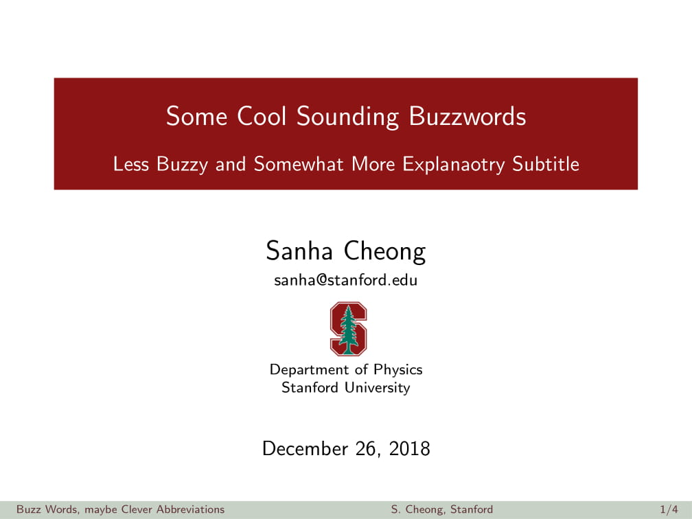
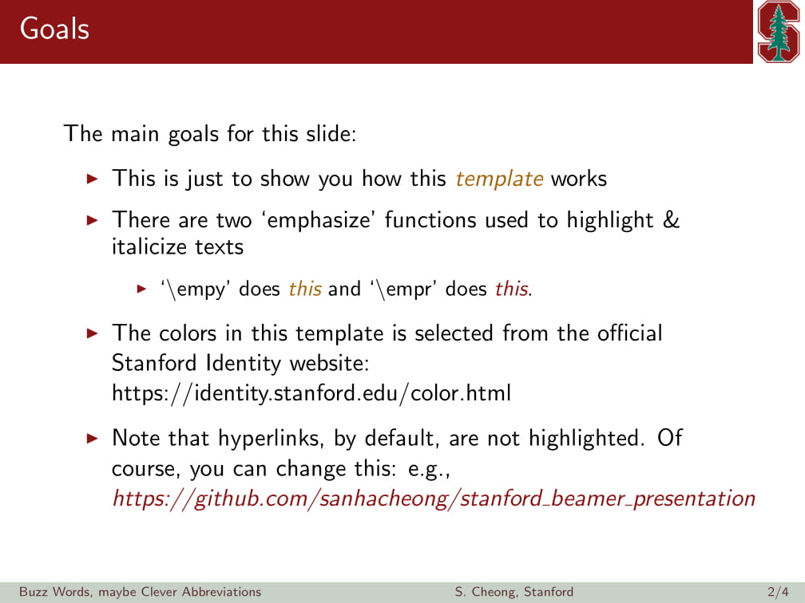
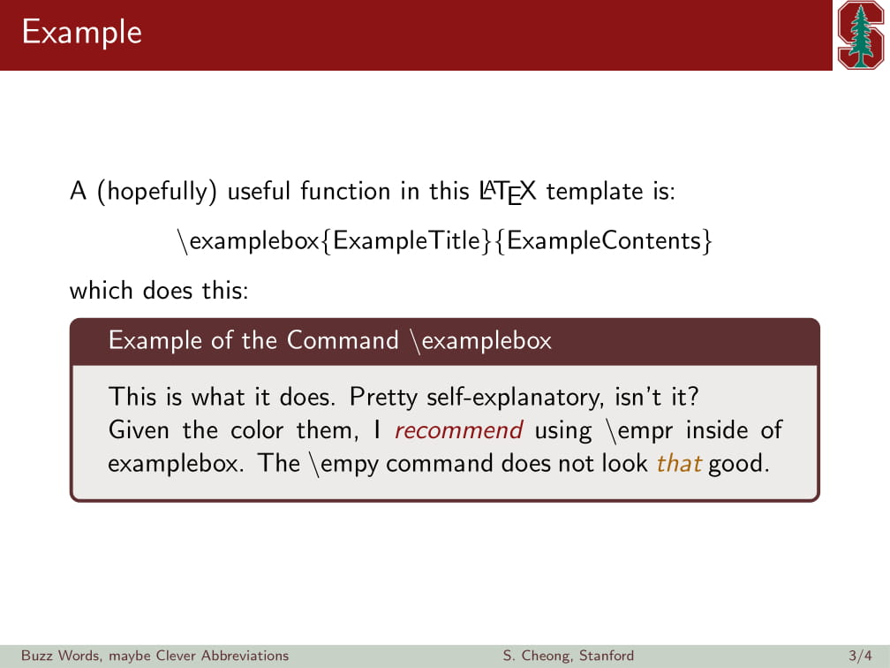
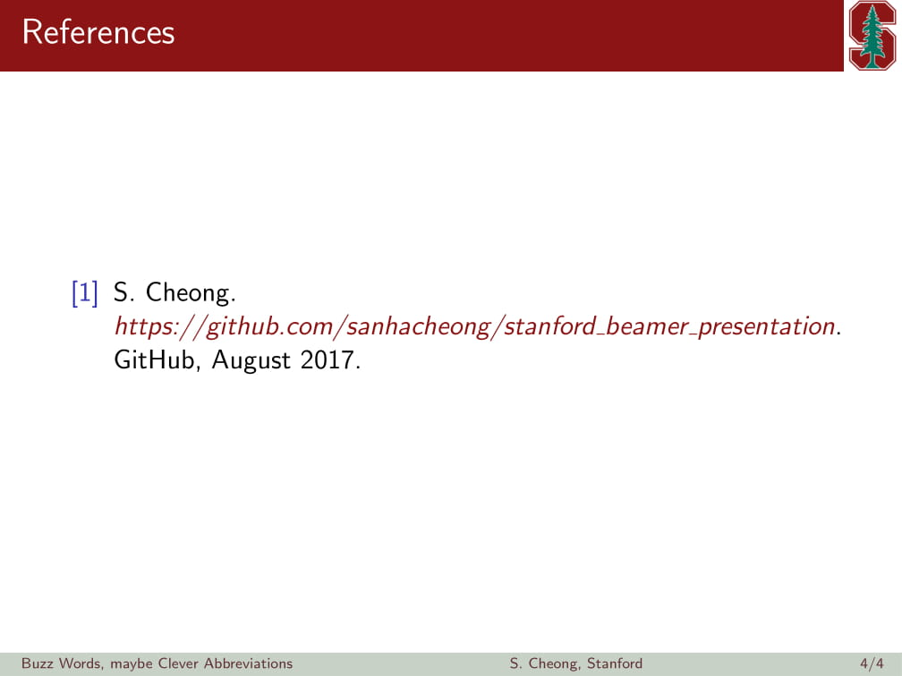

# stanford_beamer_presentation
This is an unofficial LaTeX Beamer presentation template with Stanford University theme.

Feel free to use this template for your project presentations, conference talks, etc.

The repository includes [a simple example file](./example_slides.pdf) (with the [`.tex`](./example_slides.tex) source code) and [a full, example presentation slides](full_talk.pdf) of my own (no `.tex` source code provided).

## Example Slides

